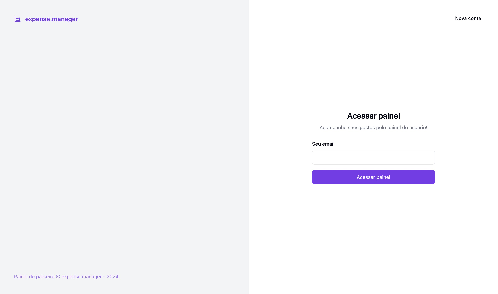
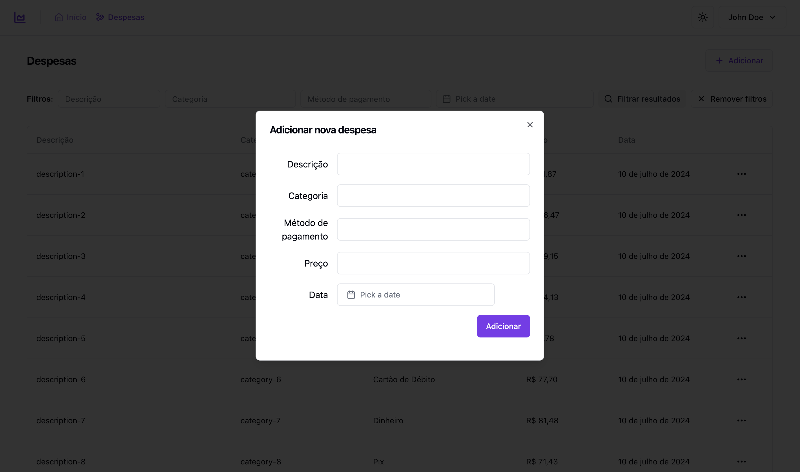

# Expense Manager Frontend

Expense Manager is a web application designed to help users manage their personal finances. This repository contains the frontend code for the Expense Manager application, built with React.

## Table of Contents

- [Features](#features)
- [Technologies Used](#technologies-used)
- [Previews](#previews)
- [Getting Started](#getting-started)
- [Prerequisites](#prerequisites)
- [Installation](#installation)
- [Running the Application](#running-the-application)

## Features

- User Authentication
- Expense Tracking
- Budget Management
- Reporting and Analytics
- Responsive Design

## Technologies Used

- **React**
- **TailwindCSS**
- **Shadcn/UI**
- **Zod**
- **Axios**
- **React Query**
- **MSW**
- **Playwright**
- **Vitest**

## Previews

- Sign in
  

- Sign up
  

- Dashboard
  

- Expenses
  

- Add expense
  

## Getting Started

To get a local copy up and running, follow these simple steps.

### Prerequisites

- Node.js (version 14 or higher)
- npm or yarn

### Installation

1. Clone the repository:

   ```sh
   git clone https://github.com/RickyHideyukiTakakura/expense-manager.git
   cd expense-manager
   ```

2. Install dependencies:

   ```sh
   npm install
   ```

   or

   ```sh
   yarn install
   ```

### Running the Application

To start the application locally, use the following command:

```sh
npm run dev
```

or

```sh
yarn run dev
```

This will start the development server and open the application in your default web browser. The application will reload if you make edits.

If you not running the backend server, you can use the following command to test the frontend application

```sh
npm run dev:test
```

or

```sh
yarn run dev:test
```
